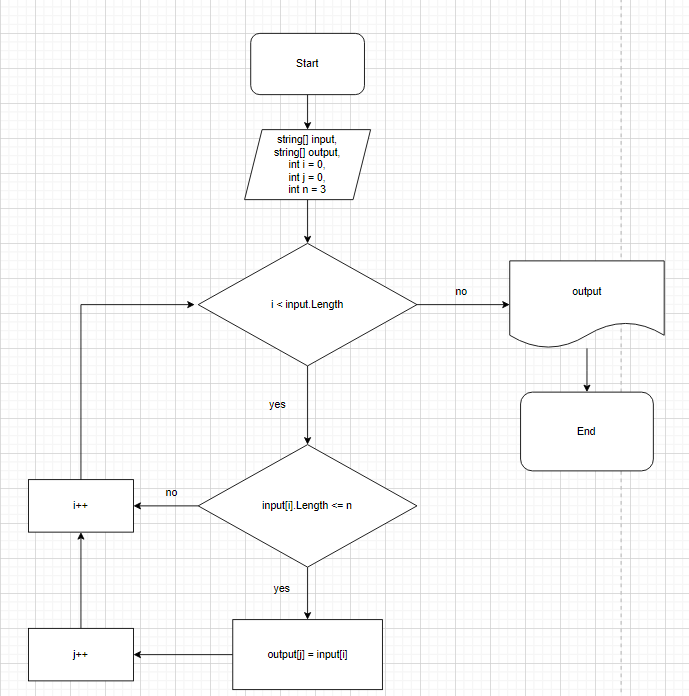

# Итоговая проверочная работа
# Условия задачи:
Написать программу, которая из имеющегося массива строк формирует массив из строк, длина которых меньше либо равна 3 символа. Первоначальный массив можно ввести с клавиатуры, либо задать на старте выполнения алгоритма. При решение не рекомендуется пользоваться коллекциями, лучше обойтись исключительно массивами.
# Алгоритм выполнения:
  * Создать репозиторий на GitHub
  * Нарисовать блок-схему алгоритма
  * Снабдить репозиторий оформленным текстовым описанием решения (файл README.md)
  * Написать программу, решающую поставленную задачу
  * Использовать контроль версий в работе над этим небольшим проектом (не должно быть так, что все залито одним коммитом, как минимум этапы 2, 3 и 4 должны быть расположены в разных коммитах)
  
# БЛОК-СХЕМА АЛГОРИТМА

# Описание алгоритма решения задачи
Пользователь указывает сколько элементов (N) он хочет задать и заполняет стартовый массив элементами в цикле N-раз.
Далее проходим по стартовому массиву в цикле и проверяем, подходит ли элемент условию **_длина символов <= 3_**. Если элемент подходит под данное условие, то мы добавляем его в новый массив, используя при этом дополнительный счетчик, чтобы элементы в новом массиве заполнялись последовательно (*без пропусков*).

# Решение задачи на языке программирования С#
Путь к решению данной задачи: Task/Program.cs